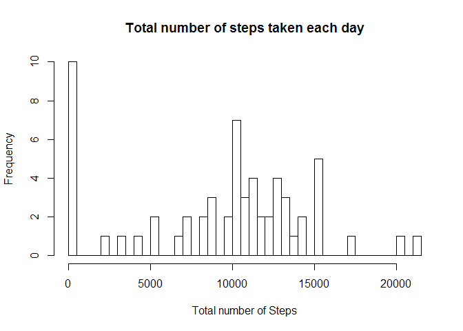
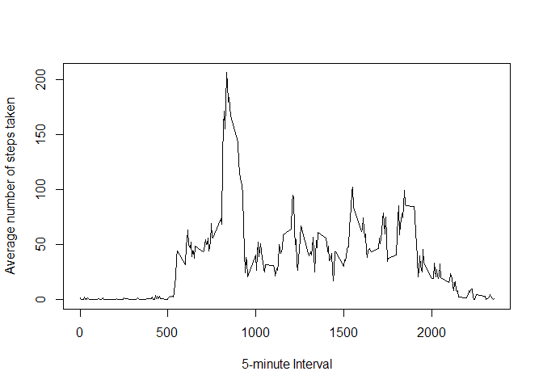
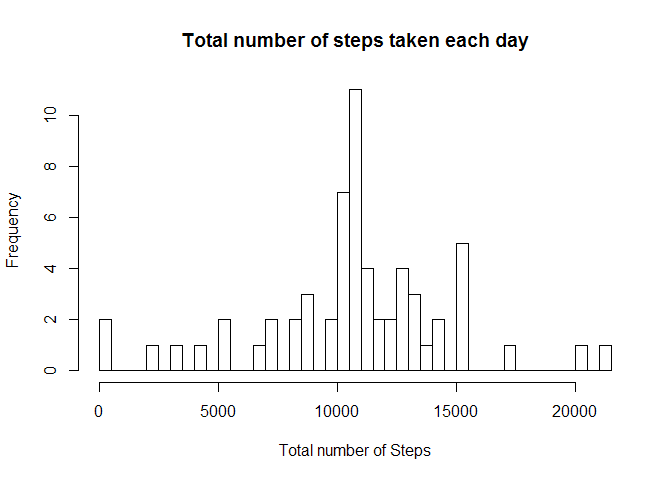
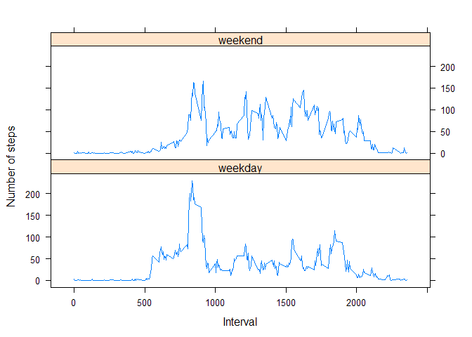

# Reproducible Research: Peer Assessment 1


```r
library(lattice)
```

## Loading and preprocessing the data
1. Load the data


```r
unzip("activity.zip")
activity <- read.csv("activity.csv")
```

## What is mean total number of steps taken per day?
1. Total number of steps taken per day


```r
totalSteps <- tapply(activity$steps, activity$date, sum, na.rm = T)
```

2. Histogram of the total number of steps taken each day


```r
hist(totalSteps, main = "Total number of steps taken each day", xlab = "Total number of Steps", breaks = 50)
```

 

3. The mean and median of the total number of steps taken per day


```r
totalSteps.mean <- mean(totalSteps)
totalSteps.median <- median(totalSteps)
```

The mean of the total steps for each day is 9354.2295082
The median of the total steps for each day is 10395

## What is the average daily activity pattern?
1. Time series plot


```r
plot(unique(activity$interval), tapply(activity$steps, activity$interval, mean, na.rm = T), type = "l", 
     xlab = "5-minute Interval", ylab = "Average number of steps taken")
```

 

2. The maximum number of steps


```r
averageTable <- cbind(unique(activity$interval), tapply(activity$steps, activity$interval, mean, na.rm = T))
mostSteps <-  gsub("([0-9]{1,2})([0-9]{2})", "\\1:\\2", averageTable[which.max(averageTable[,2]), 1])
```

The maximum number of steps is within the 8:35 interval. 

## Imputing missing values
1. The total number of missing values


```r
totalNA <- sum(is.na(activity$steps))
```

The total number of missing values is 2304

2. Devise a strategy for filling in all of the missing values in the dataset

The strategy is to fill in the NAs with mean steps for that 5-minute interval using a for loop that check if each row contains a missing value.

3. Create a new dataset


```r
activity.new <- activity
for (i in 1:length(activity.new$steps)) {
          if (is.na(activity.new$steps[i]) == TRUE) {
                    activity.new$steps[i] <- averageTable[match(activity.new$interval[i],averageTable[,1]),2]
          }
}
head(activity.new)
```

```
##       steps       date interval
## 1 1.7169811 2012-10-01        0
## 2 0.3396226 2012-10-01        5
## 3 0.1320755 2012-10-01       10
## 4 0.1509434 2012-10-01       15
## 5 0.0754717 2012-10-01       20
## 6 2.0943396 2012-10-01       25
```

4. Analysis of the new dataset


```r
totalSteps.new <- tapply(activity.new$steps, activity.new$date, sum, na.rm = T)
hist(totalSteps.new, main = "Total number of steps taken each day", xlab = "Total number of Steps", breaks = 50)
```

 

```r
newMean <- mean(totalSteps.new)
newMedian <- median(totalSteps.new)
```

The new mean is 1.0766189\times 10^{4}
The new median is 1.0766189\times 10^{4}

These values differ from the numbers in the first part of the assignment.

## Are there differences in activity patterns between weekdays and weekends?
1. Create a new variable


```r
weekend <- c("Saturday", "Sunday")
activity.new$dateType <- ifelse(weekdays(as.POSIXlt(activity.new$date)) %in% weekend, "weekend", "weekday")
```

2. Make a panel plot


```r
average.new <- aggregate(activity.new$steps, by = list(activity.new$interval, activity.new$dateType), FUN = mean)
xyplot(average.new[,3] ~ average.new[,1] | average.new[,2], data = average.new, type = "l", layout = c(1,2),
       xlab = "Interval", ylab = "Number of steps")
```

 
